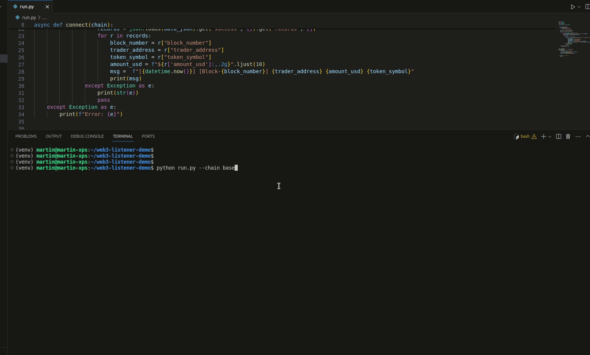

# web3-listener-demo
The easiest way to listen to DEX swaps on Ethereum and Base in real-time.



## Websocket API

To listen to new data we use the Websocket API of Syve (https://syve.ai).

Endpoint: `wss://api.syve.ai/v1/ws`

Docs: https://syve.readme.io/reference/websockets-request-syntax

This websocket can be used to listen to **blocks**, **DEX swaps**, and **token transfers** on Ethereum and Base. The docs explain how to subscribe to listen to the different types of data.

Note: **This repo is configured to listen to DEX swaps only**. However, you can easily change this to listen to the other types of data from the websocket.

## Running the script

```
cd $REPO_DIR
python run.py
```

Before running the script make sure to go over the **setup steps**.

**Configuring chain to use**

- To listen Ethereum data: `python run.py --chain eth`
- To listen to Base data: `python run.py --chain base`

By default it will listen to Ethereum data.

## Setup

### Python Installation

```
cd $REPO_DIR
python3 -m venv venv
source venv/bin/activate
pip install -r requirements.txt
```
